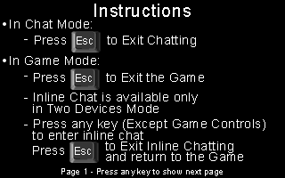

# Hit and Run
### 8086 Assembly Game inspired from Bomberman (Dyna Blaster)

### This is a group Project made for Microprocessor Systems Course

## Made By :
* ### Hager Ismail [@hagerali99](https://github.com/hagerali99)
* ### Nerdeen Ahmad [@nerdeen](https://github.com/nerdeen)
* ### Nihal Mansour [@Nihal-Mansour](https://github.com/Nihal-Mansour)
* ### Omar Mostafa [@3omar-mostafa](https://github.com/3omar-mostafa)


## Gameplay:
### The Game support two modes :

* #### Split Screen Mode :

    Same screen is used for both players

* #### Two Devices Mode :

    Each player use his own device and they are connected serially by UART protocol


### Game Demo


### Game Instructions and Legend (From Inside The Game):



## Download Game:
[Download game](https://github.com/3omar-mostafa/Hit_and_Run/releases/latest/download/Game.exe) , it can only work inside [`Dosbox`](https://www.dosbox.com)

## How to Build :

1. Install [`Dosbox`](https://www.dosbox.com)
1. Download Microsoft (R) Macro Assembler (MASM) for 16-bit version 5 , [download from here](https://drive.google.com/file/d/10Ugy88xtHzi_ocUPWH8QmiGRpUV3eJnT/)
1. Download Microsoft (R) Segmented Executable Linker (Link) for 16-bit version 5 , [download from here](https://drive.google.com/file/d/1KbSXSFzUudBQSvrWESGL0lh2Zzw58PXc/)
1. Clone this repository 
    ```
    git clone https://github.com/3omar-mostafa/Hit_and_Run.git
    ```
1. Put `masm.exe` and `link.exe` in `Hit_and_Run` folder
1. Open `Dosbox` and mount the folder `Hit_and_Run` you cloned 
    ```
    mount c c:/%PATH_TO_FOLDER%/Hit_and_Run
    c: 
    ```
    Replace `%PATH_TO_FOLDER%` with your actual folder path (Recommended to have path in English and folder names with no spaces)
1. Type `build` to build the program
1. Type `Game` to run the game
