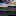
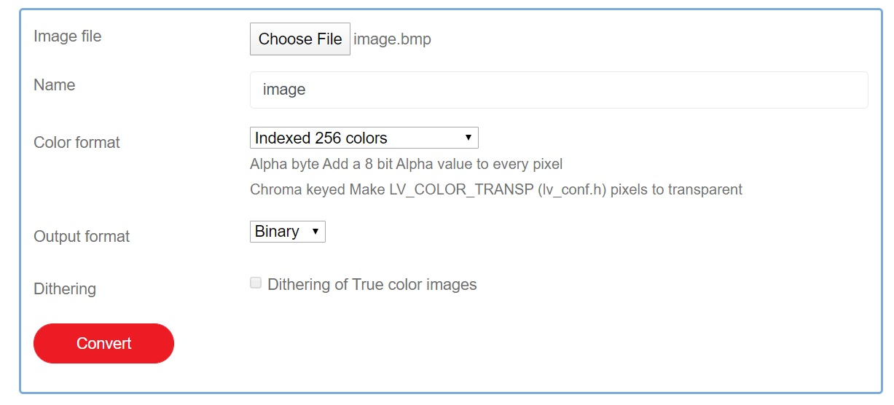

# Naming:
Max length of file names in assembly is 8 and 3 for extension, therefore names were shrank to fit this constrain.
|  Name  | Meaning |
| :----: | :------:|
|   D    |   Down  |
|   U    |   Up    |
|   L    |   Left  |
|   R    |   Right |
|   Up   |   Power Up  |
| instruc|   Instructions Page  |

---

# Creating These Images:
### Files used in code are **`.img`** files, these are binary files that contain ONLY the pixel colors of the image in *256 color VGA palette ,* while **`.bmp`** files are kept for preview only and not used.
### We use these technique because it is easier in code and smaller in size as most of our images are small and the bitmap header is larger than the image data itself.

#### 256 Color VGA Palette

### Conversion from normal images to these binary files are as follows:
- Using [Photoshop](https://www.adobe.com/products/photoshop.html) or [GIMP](https://www.gimp.org/) , we convert our image's color mode into 256 indexed color with 256 VGA Color Palette and save the file in bitmap format (.bmp) ,you can download this [Photoshop Color Table](https://drive.google.com/file/d/1C59yjrvcztIaYTzAZ_e0XO8rY9wAnSS8/) for 256 VGA colors
- Go to this [website](https://lvgl.io/tools/imageconverter) to convert your image into binary C-array, apply same configuration as in the below figure.

Conversion to C-Array binary file is used because it simplifies the file and reshape the image in correct way (pixel data in bitmap files are stored in inverted order)

- Use any Hex editor to:
1. Remove bitmap header bytes, the first 1028 byte (in decimal)
1. If the last byte in file is ***A0*** (in hex), remove it

### Youtube video that shows these steps [Arabic Language]
[!["Drawing Pictures in 8086 Assembly [Arabic]"](http://img.youtube.com/vi/wwxwYr88QsU/0.jpg)](http://www.youtube.com/watch?v=wwxwYr88QsU "Drawing Pictures in 8086 Assembly [Arabic]")

